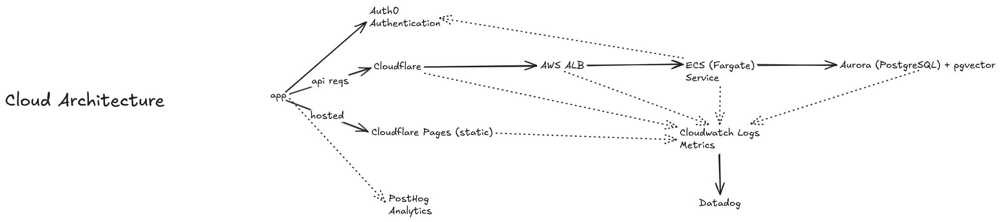
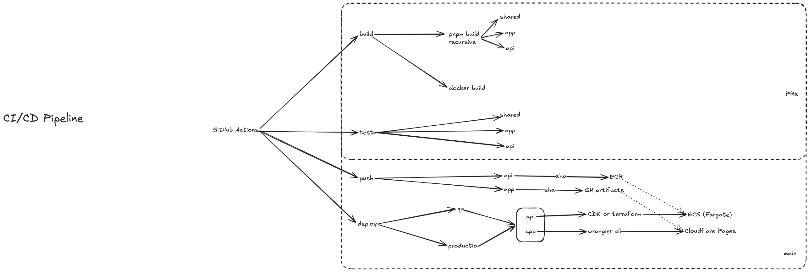
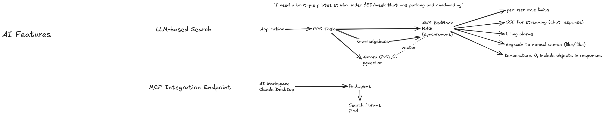

# Notes (Stage 3)

[Excalidraw Diagrams](https://excalidraw.com/#json=FLSSQ9Bx4gt75kl3hTdVm,T7aD7Hp_HH99nZWqtGmMJw)

My implementation followed a Node.JS + React stack, as it enabled me to easily re-use the types and validations between the back-end and front-end without having to introduce OpenAPI generation (for simplicity sake of the challenge).

I chose to do this in express.js as a bit of a challenge, as I felt Nest.JS would add a lot of bloat and distract from my actual implementation. In practice, I would not take this approach for a production app and use something like Nest for a Node.JS project to establish industry conventions and improve developer experience. In retrospect, using express took a lot longer than using a more opinionated framework, as input validations and middlewares were fiddly to introduce with type safety.

I used the React Router CLI to generate the app structure. It's a bit overkill for this but it establishes conventions that could benefit a project as it becomes more complex. It includes SSR functionality which is not necessary for this application. If SEO was a concern, I would look at edge workers before introducing SSR for simplicity and availability.

I didn't have time to add tests, but the functionality is simple enough that they are not necessary at this stage for a prototype.

Going towards a production release, the following would need to be addressed:

- Authentication (e.g. via Auth0)
- Persistance (e.g. Postgres on Aurora for Bedrock integrations)
- Rate limiting
- IaC and CI/CD
- Metrics and observability
- Unit and E2E testing

## Production Architecture

My choice of cloud: Amazon Web Services. Bedrock is fantastic, and integrates natively with Aurora. For AI features it's quite easy from an engineering perspective. A more AI-heavy platform may benefit from living on GCP.

- Back-end dockerised and hosted on ECS (Fargate) for simplicity, redundancy, and rolling updates
- Front-end statically build and deployed to cloudflare pages. It is simple, free, extremely fast, and SSR is not necessary. Not using SSR ensures maximum uptime and availability.
- Database would use Aurora because of its integrations with Bedrock, would make AI features very easy to implement
- Hosted behind an ALB in a dedicated VPC + private/public subnets for load balancing and rolling updates during deployments.
- WAF via Cloudflare to leverage their bot prevention and DNS features
- Deployment via CDK (typescript) or Terraform, depending on cloud asnosticism (TF would allow us to manage Cloudflare resources as well)

# Deployment

CI/CD using github actions

- PR checks build + test
- push and deploy only on main + PR checks with merge queue
- branch protection
- deploy via CDK or Terraform
- deploy app to Cloudflare Pages using wrangler

Terraform would be better for including Cloudflare resources, but CDK may be a better option for the Typescript-native stack. Unfortunately cdktf has been discontinued recently, otherwise I would've picked it as the primary option.

## AI Integration (LLM + MCP)

LLM for conversational search.

- AWS bedrock due to simplicity of integration with Aurora.
- Update knowledgebase when a gym is created or updated, perform regular full sync on schedule
- Synchronous + streaming (hybrid) for immediate chat responses, returning Gym objects with response
- Zod validation for requests and responses from Bedrock
- Bedrock guardwail prompts to prevent users from inappropriate words, political commentary, and competitors not listed in our results
- Retries using exponential back-off for rate limits, fallback to normal textual search
- Cost ceiling alarms via AWS
- Audit trail table for LLM requests and responses
- Limit number of gyms returned from query to limit context window size

MCP for AI Workspaces (e.g. Claude Desktop)

- Simple find_gyms method performs highly efficient SQL queries to find and list gyms
  - inputs include fuzzy search, address, amenities, etc.
- OpenID dynamic client registration + authentication for users
