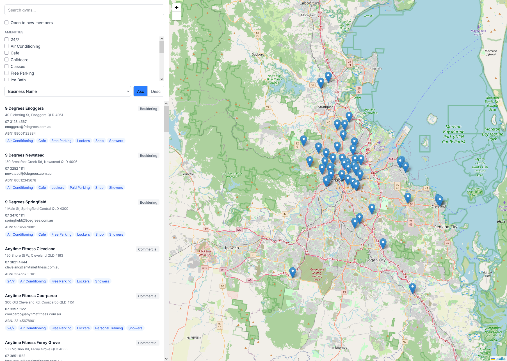
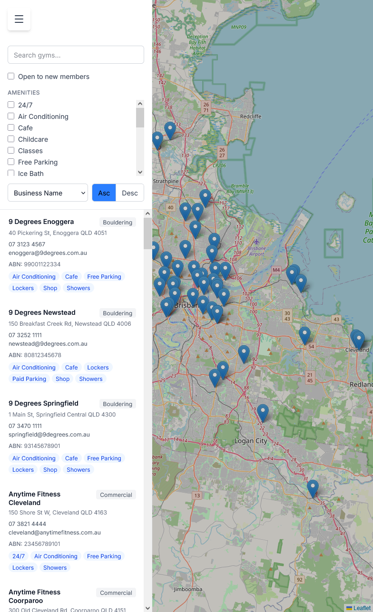
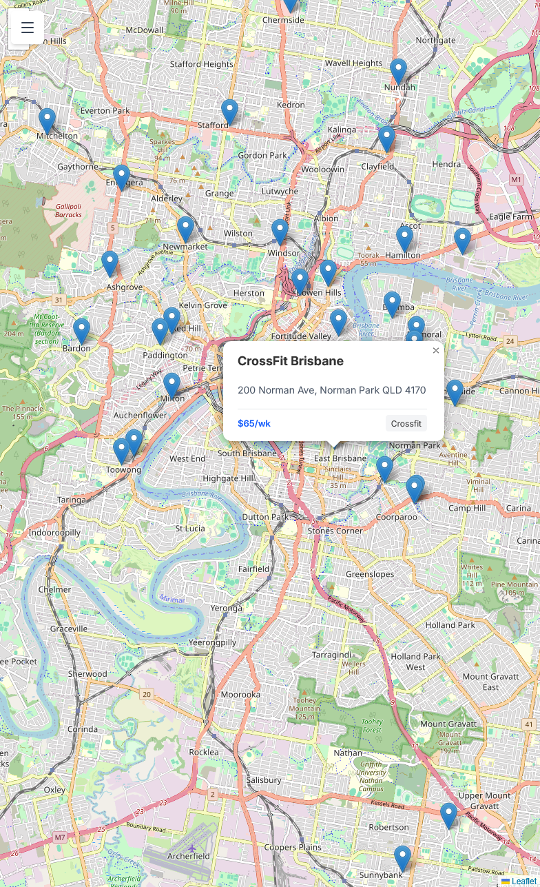

# Clubworx Gym API & App - Sean McCullough



My submission for the Clubworx technical challenge to build a basic gym search API and Web App. My implementation uses React and Node.JS (express) in order to simplify the type reuse between the two without introducing OpenAPI.

My implementation is 90% manually coded, with 10% Claude to help solve some tricky bugs and issues with Leaflet.

The React App uses a basic store using the `useSyncExternalStore` hook for a simple dependency-free state management. Search result components are memoised as they are re-rendered frequently.

Leaflet is used for a map overview. I've been doing a lot of Leaflet and geospatial data in my own project recently and felt it was a good application of skills here.

The Gym data was generated using an LLM and is not accurate, but somewhat close to look realistic. [It's in a static JSON file.](./api/data/gyms.json)

## Documentation

- [Notes](./NOTES.md)
- [Tasklist and Checklist](./TASKS.md)

## More screenshots





## Setup

1. **Pull the repository:**

   ```bash
   git clone https://github.com/SeanLMcCullough/clubworx-challenge seanlmccullough
   cd seanlmccullough
   ```

2. **Install dependencies:**
   ```bash
   npm install --global corepack@latest
   corepack enable pnpm
   pnpm install
   ```

## Running Locally

Start both the API and UI development servers concurrently from the root directory:

```bash
pnpm dev
```

- **Frontend (React/Vite):** `http://localhost:5173`
- **Backend (Node API):** `http://localhost:3000`
